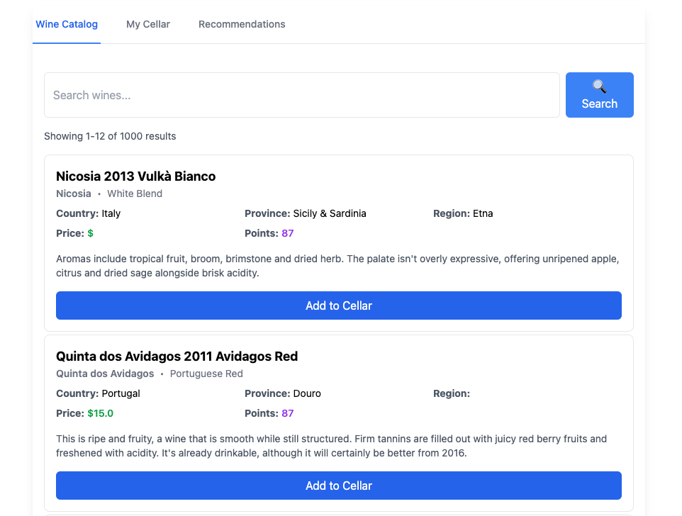

# `wineinfo`

A sample web application for Junction demos.

The app is a wine catalog that's built with a React frontend and multiple
FastAPI backend services to handle traditional full-text search, LLM-based
vector search, and saving bottles to a collection.

## Generating Vector Data

We live in a post-GPT era, of course our application requires a vector database.
The demo app can run without any data, but it'll be pretty boring.

Generating the data is best done in your local environment, rather than in a
container. In this directory, run

```bash
python3 -m venv .venv
source .venv/bin/activate
pip install --upgrade uv
uv pip install -r backend/requirements.txt
python3 backend/bin/build_data.py
```

## Deploying

This demo focuses on dynamic discovery in Kubernetes. To make it easy to run
without being a Kubernetes whiz, it runs in a self-contained [`k3d`][k3d] cluster.

To run the demo you need `docker` and `kubectl` installed. This README won't cover
installing those tools.

Once you've gotten both `docker` and `kubectl` set up, install `k3d` by running:

```bash
curl -s https://raw.githubusercontent.com/k3d-io/k3d/main/install.sh | bash
```

or check out the [official k3d installation instructions][k3d-install]

[k3d]: https://k3d.io/
[k3d-install]: https://k3d.io/v5.7.4/#install-script

Once you've installed `k3d` (check that it works by running `k3d version`) you can
start the demo:

```bash
./deploy/setup.sh
```

Once your'e done, point your browser at <http://localhost:8010> and you should see
the working wine UI.


