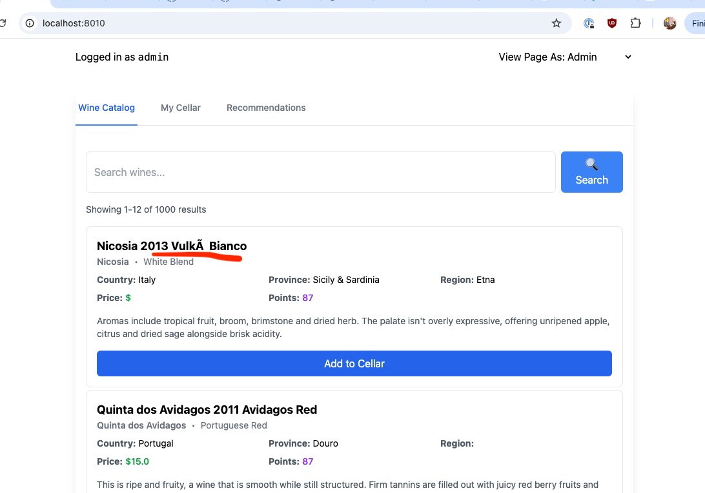

# Simple Routing

The WineInfo catalog team has just done a huge rewrite of the catalog service
and moved all the catalog data from PineScaleDB to ElasticRiak. In YOLO mode,
they rolled it into production without any testing or QA. You can simulate their
deploy by upgrading the catalog yourself and deploying the new version of the
catalog to Kubernetes.

```bash
$ kubectl apply -f demo/deploy/02_routing.yaml
```

As soon as the upgrade lands, bug reports will start rolling in. Uh oh. If you
look at the UI, you should now see something like this:



Looks like they got [character encoding
wrong](https://en.wikipedia.org/wiki/Mojibake)!

The catalog team already has a fix ready, but this time, you want site admins to
quickly QA it before they do another rollout.

We can do this easily with Junction! Since all of our Services are using the
Junction client, it's easy to deploy a Junction Route that will show all site
admins the fixed version of the catalog service to verify that we have un-YOLOd
our encoding problems.

Let's set up a Junction Route to do that.

```bash
$ python demo/scripts/02_routing.py
httproute.gateway.networking.k8s.io/wineinfo-catalog-default-svc-cluster-local created
```

Once you deploy the route, switch to the "admin" view in the UI and make sure you 
don't see any more character encoding issues.


Hooray! We are now happy to deploy their fix to prod.

## What Just Happened?

When the Catalog team deployed their fix, they deployed it as a second
Kubernetes Service.

```bash
 $ kubectl get svc/wineinfo-catalog svc/wineinfo-catalog-next
NAME                    TYPE        CLUSTER-IP      EXTERNAL-IP   PORT(S)   AGE
wineinfo-catalog        ClusterIP   10.43.4.131     <none>        80/TCP    15m
wineinfo-catalog-next   ClusterIP   10.43.118.111   <none>        80/TCP    14m
```

We then used a Junction Route to route requests for `wineinfo-catalog` to
`wineinfo-catalog-next`, but only when the requester is logged in as an admin.

Our architecture diagram momentarily looked like this:

```text
                                          ┌─────────────┐
                                          │  Frontend   │
                                          └─────┬───────┘
               baggage:username=admin     ┌─────┴───────┐
             ┌────────────────────────────┤   Backend   ├──────────────┐
             │                            └─────┬───────┘              │
             │                 ┌────────────────┼────────────────┐     │
      ┌──────┴──────┐   ┌──────┴──────┐   ┌─────┴───────┐   ┌────┴───┐ │
      │ Catalog-Next│   │   Catalog   │   │   Search    │   │  Recs  │ │
      └─────────────┘   └──────┬──────┘   └─────┬───────┘   └────┬───┘ │
                               └────────────────┼────────────────┘     │
                                                │                      │
                                           ┌────┴──────┐               │
                                           │  Persist  ├───────────────┘
                                           └───────────┘
```

Routes are one of the most fundamental building blocks in Junction. They give
you the ability to apply rules to every outgoing HTTP request based on its
contents. Here's the complete Route we set up to redirect admin requests to the
catalog-next service:

```python
catalog: config.Service = {
    "type": "kube",
    "name": "wineinfo-catalog",
    "namespace": "default",
}
catalog_next: config.Service = {
    "type": "kube",
    "name": "wineinfo-catalog-next",
    "namespace": "default",
}

is_admin = config.RouteMatch(headers=[{
    "type": "RegularExpression", 
    "name": "baggage", 
    "value": ".*username=admin(,|$).*"}
])

route: config.Route = {
    "id": "wineinfo-catalog",
    "hostnames": [service_hostname(catalog)],
    "rules": [
        {
            "matches": [is_admin],
            "backends": [{**catalog_next, "port": 80}],
        },
        {
            "backends": [{**catalog, "port": 80}],
        },
    ],
}
```

A Route has multiple parts we'll dissect in detail. The whole point of a Route
is to match outgoing HTTP requests and then decide which Backend they should hit.

### Matching Hostnames

The first part of this Route describes which hostnames to match.

```python
    "hostnames": [ service_hostname(catalog) ],
```

Hostnames are special, so they're matched first - they're how you communicate
your intent about where a request should go. This time, the hostname we're using
is one we're computing from the name of the `catalog` service, but it could be
any hostname you'd like.

### Matching Rules

Every Route has a set of `RouteRules` to match traffic within them. RouteRules
have a set of matches, and if any match an outgoing request, it's sent to one of
the backends listed as part of the route.

Our goal here is to only route logged-in administrators to the new version of
the catalog service. In our Wineinfo services, when someone is logged in, we add
the 'username' header to every request and pass that along, which we can then
match in a Junction route. To do so we put the username field in a thing called
baggage, [which we explain below](#Why-do-we-use-baggage?). Essentially it is a 
list of comma-separated `k=v` pairs in a header named "baggage", so we match from 
it with a regular expression like:

```python
is_admin = config.RouteMatch(headers=[{
    "type": "RegularExpression", 
    "name": "baggage", 
    "value": ".*username=admin(,|$).*"}
])
```

The first rule in the rules list only has one match on `is_admin` routing to
the `catalog_next` service.

```python
        {
            "matches": [is_admin],
            "backends": [{ **catalog_next, "port": 80 }],
        },
```

The second rule is a catch-all rule. It has no `matches,` which matches
any outgoing request. When this rule matches, it sends requests to the `catalog_url`
service.

```python
        {
            "backends": [{ **catalog, "port": 80 }],
        },
```

For now, that's all there is to know about Routes. As we get further into
exploring Junction, we'll use Routes to match on other parts of outgoing
requests or to make our applications more resilient to failure.

### Backend Services

Both of those rules have Backends, which describe where to send traffic once the
rules match.

Junction supports two types of Backend services. The first is where the IPs are
looked up in the client's DNS. The second is where the IP's are pulled from
Kubernetes and sent down to the client directly. For services in Kubernetes, the
second is the recommended option, so that's what we're using here, but Junction
wants to give you the control to configure either behavior.

You can list multiple backends for a rule, and Junction will distribute traffic
evenly between them. If you list no backends for a rule, Junction will
immediately return an error for any matching request before it even hits the
network.

## Unit Testing

Why were we so confident that we could quickly preview traffic to our new
version of the catalog? Because we could unit-test our changes before shipping
them!

A Route is just data, and Junction runs client-side, so we can test that our
Route does what we expect without actually making HTTP requests or talking to
the Junction control plane.

Calling `junction.check_route` with a list of Routes returns the Route that we
matched to make sure we got the hostname right, the index of the rule that
matched so we can check on our matching logic and the backend that requests
will get routed to.

```python
(route, rule_idx, backend) = junction.check_route(
    routes=[route],
    url="http://" + service_hostname(catalog) + "/",
)
assert rule_idx == len(route["rules"]) - 1
assert backend == { **catalog, "port": 80 }
```

This double-checks that:

- The rule that matched is the last rule in our route.
- The backend is also the `catalog` service listening on port 80.

 Let's try again with an authenticated request. All we have to do is set our
 x-username header to the value "admin" and we're ready.

```python
(route, rule_idx, backend) = junction.check_route(
    routes=[route],
    url="http://" + service_hostname(catalog) + "/",
    headers={"baggage": "username=admin"},
)
assert rule_idx == 0
assert backend == { **catalog_next, "port": 80 }
```

Here we check:

- The first rule should match, not the last rule.
- The backend should be the `catalog-next` service.

Nice! All of our unit tests pass so we can confidently deploy our route.

## Messing around

An easy way to interact with Junction is to open a Python REPL on a running
Python service:

```bash
kubectl exec -ti $(kubectl get po -o=name -l app=wineinfo,service=catalog) -- python
```

Try looking at the Routes that exist for the catalog or search service:

```python
import junction
import json

j = junction.Junction()
print(json.dumps(j.resolve_route("GET", "http://wineinfo-catalog.default.svc.cluster.local", {}), indent=4))

print(json.dumps(j.dump_routes()))
```

## Cleaning up for the next step

To roll back this demo and leave the application in working order for the next
demo, run:

```bash
kubectl delete httproute.gateway.networking.k8s.io/wineinfo-catalog
kubectl delete -f demo/deploy/02_routing.yaml
kubectl apply -f deploy/wineinfo.yaml
```

When you're done, head over to [03_retries.md](03_retries.md).

If you're fully done, you can fully delete your k3d cluster with:

```bash
k3d cluster delete junction-wineinfo
```

## Why do we use baggage?

This is just for those curious. Junction can match any HTTP header name, so 
for instance we could have matched `{"name": "x-username", "value": "admin"}`
if that's what our services were emitting. 

The reason we use baggage though, is its a newish
[standard](https://www.w3.org/TR/baggage/) from Open Telemetry for
application-level context propagation through headers. In the simplest form, it
just looks like comma separated key=value pairs, carried in a HTTP header
named "baggage":

```
baggage: tenant_id=acme-corp-123,shopping_cart_id=cart-454,environment=staging
```

OTel of course are interested in it for observability context, but we think it
is useful for Junction routing for 2 reasons:
* if you want to route on it, you generally want to have the ability to observe
it being routed
* OTel has put quite a bit of work of making this propagation transparent from
the application code in a bunch of frameworks, so if you use those frameworks
you can get headers propagated from request to request without changing any code

Note for our sample app, we didn't want to integrate with OTel, so we did write
custom baggage handling code. But all it needs to do is look at all headers
named "baggage", and forward them onto any outgoing call.
